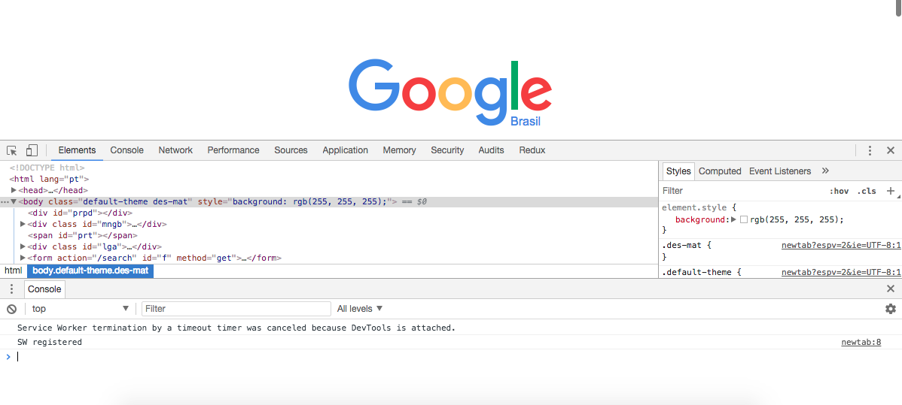

# Capítulo 1: Node.js, ES6, ES67 e além.

Como a intenção do livro é realmente focar em código e nas Libs JavaScript, vamos dá apenas uma breave explicação do que são as versões JavaScript para aqueles que estão tendo o primeiro constato com a linguagem.

JavaScript é uma linguagem orientada a objetos criada para trabalhar do lado do cliente, ou seja, no Browser(Navegador). JavaScript está presente se não todos, em quase todos os Browsers existentes. E com o lançamento do Node.js possibilitanto a linguagem rodar não só do lado do cliente, mas também do lado do Servidor, assim como Java, Ruby, Python e muitas outras. Com isso JavaScript passou a ser conhecido como 'o Inglês das linguagens de programação'.

Se você já andou pesquisando sobre JavaScript, já deve ter se deparado com as siglas ES5, ES6 ou ES7 assim por diante. Isto é simples, assim como Java tem suas versões Java 8, Java 9... JavaScript também é versionado e JavaScript é versionado sobre o Padrão Internacional ECMA, o que resulta no nome ECMAScript e assim nós temos ECMAScript 2015, ECMAScript 2016 e assim por diante. A única confusão é que  ECMAScript 2015 = ES6 e ECMAScript 2016 = ES7. Não entrarei em detálhes sobre isso más você poderá encontrar mais assunto aqui: https://pt.wikipedia.org/wiki/JavaScript

No livro assumiremos as versões ES6 e ES7 para desenvolvimento. Assim daremos uma passada rápido sobre algorítmo para aqueles que não conhecem a linguagem. Não se preocupe, para o livro com uma base em algorítmo você conseguirá acompanhar.

## JavaScript no Navegar.

Como já falamos antes JavaScript foi uma linguagem criada para rodar do lado do Browser assim,para começar-mos vamos abrir o Navegador do seu computador. No caso do livro assumiremos o Google Chrome: https://www.google.com/chrome/browser/desktop/index.html.

Abra o Chrome ou Navegador da sua escolha. Para abrir o DevTools ou Console do Desenvolvedor:
Pressione F12 ou Cmd+Opt+Jc no Mac.



Com o console aberto vamos para a Aba `Console`. E onde o cursor aponta vamos fazer o nosso primeiro programa `Olá Mundo`:

```javascript
  
  alert("Olá Mundo!"); // tecle Enter para executar

```
Como percebido nosso programa gerou uma caixa com alerta `Olá Mundo!`. Pronto você criou seu primeiro programa JavaScript. Percebeu a facilidade?

### Variáveis

Variáveis são onde armazenamos valores para uso futuro ou não. Em JavaScript temos `var`, `const` e `let`. O `var` já é consideraod obsoleto então vamos focar apenas nos outros dois. Nosso próximo programa será uma Catraca de Festa para maiores de 18 anos. A regra é se maior de 18 pode entrar se não mandar para casa.

```javascript

  const nome = prompt('Qual o seu Nome?');
  const idade = prompt('Qual a sua Idade?');
  let menssagem = '';

  if (idade >= 18) {
    menssagem = 'Pode entrar.';
  } else {
    menssagem = 'Não pode Entrar. Hora de criança está em casa!';
  }

  console.log(`O cliente ${nome} ${menssagem}`);

```

Ao executar nosso Programa Catraca de Festa podemos ver o resultado de acordo com os dados passado pelo o usuário. Também aprendemos que o `const` e `let` podem assumir qualquer valor passado `String` ou `number`. Devemos saber que JavaScript assume outros tipos como: `boolean` como `true` e `false`. Tipos `null`, `undefined`, `Date` e muitos outros que você verá no decorrer do livro.

Nesses dois programas aprendemos também que é possível fazer comentários em nosso código com `//`. E aprendemos a lidar com os operadores condicionais `if` e `else`.

Mas se você já tiver alguma experiência em alguma linguagem de programação você não sentiu dificuldades de entender o código. O que eu gostaria de chamar a atenção aqui é para o `const` e o `let`, eles parecem se comportar com o mesmo próposito, mas se você rodar novamente o programa perceberá que receberá um error:

```javascript

  Uncaught SyntaxError: Identifier 'nome' has already been declared
    at <anonymous>:1:1

```

Isso porque `const` assim como let é um operador de escope, mas `const` não poder ser reatribuído. Assim podendo ser declarado apenas uma vez no nosso programa. A importancia do `const` é que quanto menos `let` tivermos em nossa applicação, menos complexo será nosso código. Pois o `const` não permite atribuir novos valores em nossa variável, assim evitando efeitos indesejados.

```javascript

  function isMaiorDeIdade(idade) {
    return idade >= 18 ? 'Pode entrar.' : 'Não pode Entrar. Hora de criança está em casa!';
  }

  const nome = prompt('Qual o seu Nome?');
  const idade = prompt('Qual a sua Idade?');
  const menssagem = isMaiorDeIdade(idade);

  console.log(`O cliente ${nome} ${menssagem}`);

```

Agora podemor notar o quanto a complexidade do código diminuiu usando apenas `const` e evitando códigos 'macarrônicos' ou seja cheios de if's e else's tornando nossa lógica difícil de se entender. Podemos notar também que criamos uma `function` chamada `isMaiorDeIdade`, ela recebe uma idade e com um operador ternário retornamos uma `string` se atendendo a regra imposta.

Isto foi apenas um básico de algorítmo e para mostrar como o livro abordará os códigos durante os capítulos. Para mais detalhes sobre a linguagem recomendamos alguns sites como: https://www.w3schools.com/js/

## Node.js - JavaSript aqui, ali, JavaScript em todo Lugar.

# Consigurando Ambiente de Desenvolvimento